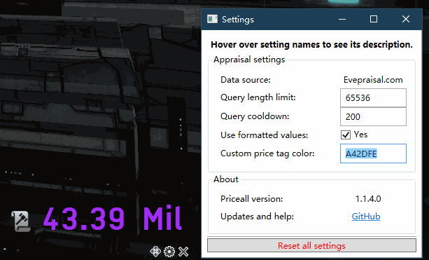
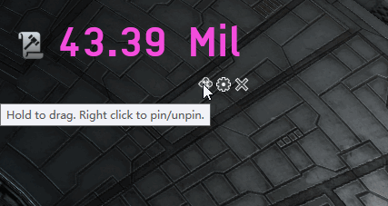
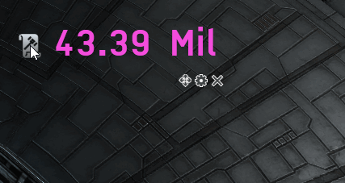
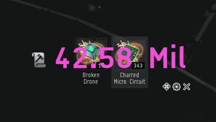

# Priceall 

Priceall is an app for quick EVE Online price-checking.

If you are an explorer, an industrialist, or a trader,
this app will help you to get an appraisal on a list of items
**as quick as possible**, without you moving eyes away from the game.

# Works with

 

# Table of Contents

- Usage: how to download; how to use
- Development: information regarding Priceall's repo
- Changelog: new features and bug fixes

# Usage

Head over [here](https://ci.appveyor.com/project/xyx0826/Priceall/build/artifacts)
and download `build.zip` to get the latest version.

To get an appraisal, simply **copy** a list of items. Priceall will do the work for you.

*Feel like using a hotkey? Create one in the settings.*

Choose to show **numeric** price or **formatted** price.

Customize the price tag **color**.

*Hex numbers not your jam? Try out Google
[color picker](https://www.google.com/search?q=color%20picker).*

**Drag** the widget to anywhere you want and **pin** it down.

Scroll to change background **transparency**, or hold **Control** and scroll to change widget **size**.

Make the widget **fully transparent** to allow **click-through**.

# Development

Priceall uses C# with WPF. Issues, suggestions and pull requests are welcome.

The `master` branch contains stable code. The AppVeyor badge and download link above also link to `master` branch's build feed.

Priceall's development now happens on the `dev` branch that may contain unfinished or unstable features. Please direct all pull requests to the `dev` branch.

My in-game character is `Sector Sabezan`. Feel free to send me ISK donations if you wish!

# Changelog

## Version 1.5, build 11

- *(karl-kaefer @ GitHub)* Added support for [Janice](https://janice.e-351.com/) appraisal.
- Added support for customizing or removing appraisal hotkey.
- Fixed an issue where Priceall will not close upon the `Alt-F4` hotkey.
- Added a link to Google color picker from settings.
- Significant internal refactors.

## Version 1.4, build 10

- Added a simple app icon for Priceall.
- Rewrote settings handler code to use event model.

## Version 1.4, build 9

- *(razaqq @ GitHub)* You can now customize query hotkey in settings.
  - Click on the editor textbox and press the key combo of your choice.
  - The new hotkey will immediately take effect.
  - *Known issue: weird display in the editor textbox.*

## Version 1.3, build 8

- Fixed an issue where Priceall will not start with auto-refresh enabled as intended.

## Version 1.3, build 7

- *(razaqq @ GitHub)* You can now enable **auto refresh** on clipboard content changes.
  - When enabled, Priceall will perform a price check whenever clipboard text changes. No hotkeys needed! Query cooldown still applies.
  - *We cannot estimate its impact on Evepraisal server performance. Priceall may kindly ask you to turn it off when things get out of control.*

## Version 1.2, build 6

- *(Perry_Swift @ Reddit)* You can now choose to use **conditional colors**.
  - Specify a **lower** price threshold and a color, as well as an **upper** one.
  - If the price is below the lower threshold, the lower color will be used.
  - If the price is above the upper threshold, the upper color will be used.
  - In case two thresholds conflict (e.g. higher threshold is less than lower threshold), the **lower** one will take precedence.

## Version 1.2, build 5

- Priceall will now check for updates on launch. If you see the settings button turning orange, there is an update available.
- Your settings will no longer be lost when updating Priceall.

## Version 1.1, build 4

- *(Tragot_Gomndor @ Reddit)* You can now hold `Ctrl` and scroll to change window size.
- *(Tragot_Gomndor @ Reddit)* You can now choose simple price display (e.g. `12.34 Mil`) instead of whole numbers.
  - *Turn on/off this feature in the settings.*
- *(Tragot_Gomndor @ Reddit & karl-kaefer @ GitHub)* You can now tune window opacity down to zero and allow click-through.
  - *Icon, text and buttons on the widget will still be clickable.*
- You can now specify a hex color (e.g. `C4B3A2`) for price tag display.
  - *If you specify an invalid color, Priceall will use white.*
- There is now a "Reset all settings" button in the settings.
  - *Known issue: you need to click the button twice to fully reset the window's position and size.*
