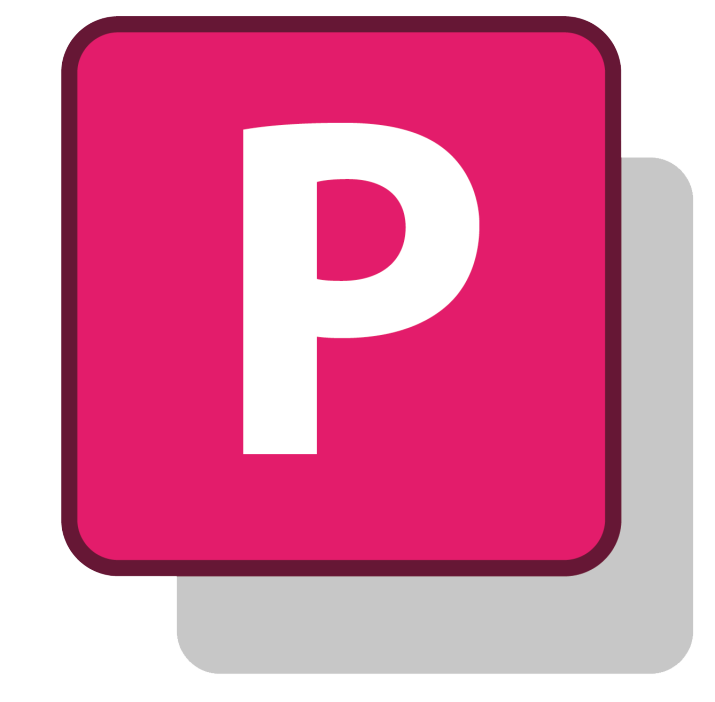
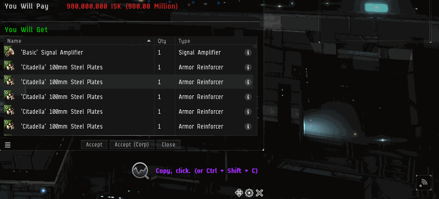

# Priceall  

Priceall is an app for quick EVE Online price-checking.

If you don't like tabbing out and pasting to browser, then this app is for you!

# Table of Contents
- Usage: how to download; how to use
- Development: information regarding Priceall's repo
- Changelog: new features and bug fixes

# Usage
Click [me](https://ci.appveyor.com/project/xyx0826/Priceall/build/artifacts) and download `build.zip` to get the latest version!

Priceall is designed for checking item list prices **as quick as possible**, without moving your eyes away from the game.

**Copy** an item list and hit `Ctrl + Shift + C` to let Priceall do the work for you.

**Experimental:** you can now enable auto refresh. When clipboard content changes, Priceall will automatically do a price-checking for you.

From settings, you can choose to show **numeric** price or **formatted** price.

And you can also customize the price tag **color**. Google [color picker](https://www.google.com/search?q=color%20picker) will come in handy!

**Drag** the widget to anywhere you want and **pin** it down.

Use mouse scroll to change background **transparency**, or hold `Ctrl` and scroll to change widget **size**.

If you make the widget **fully transparent**, it can support **click-through**.

**Things to know:**
- Priceall works as an always-on-top window - it's not an actual "overlay" like the one Steam or Discord have. Therefore it might not work for fullscreen game.
- Priceall currently uses [Evepraisal](http://evepraisal.com) for price checking. Thus, Priceall supports all kinds of item list that Evepraisal supports - cargo scan results, contracts, blueprint material lists, etc.
- Priceall's hotkey, by default `Ctrl + Shift + C`, is *global* and by design will not be passed to other apps.

There are three buttons at the bottom: Drag, Settings and Close.

To drag the window around, drag the Drag button. Right click the Drag button to pin/unpin the window.

To change window background transparency, hover mouse over the window and scroll. Window background color customization will come later.

To resize the window, hold `Ctrl` and scroll on the window.

# Development
Priceall uses C# with WPF. Issues, suggestions and pull requests are welcome.

The `master` branch contains stable code. The AppVeyor badge and download link above also link to `master` branch's build feed.

Priceall's development now happens on the `dev` branch that may contain unfinished or unstable features. Please direct all pull requests to the `dev` branch.

My in-game character is `Sector Sabezan`. Feel free to send me ISK donations if you wish!

*Dataminers: also check out my other repo, `TriExplorer`. It's a modern remake of `TriExporter`, but still in development.*

# Changelog
## Version 1.4, build 10
- Added a simple app icon for Priceall.
- Rewrited settings handler code to use event model.

## Version 1.4, build 9
- *(razaqq @ GitHub)* You can now customize query hotkey in settings.
  - Click on the editor textbox and press the key combo of your choice.
  - The new hotkey will immediately take effect.
  - *Known issue: weird display in the editor textbox.*
## Version 1.3, build 8
- Fixed an issue where Priceall will not start with auto-refresh enabled as intended.

## Version 1.3, build 7
- *(razaqq @ GitHub)* You can now enable **auto refresh** on clipboard content changes.
  - When enabled, Priceall will perform a price check whenever clipboard text changes. No hotkeys needed! Query cooldown still applies.
  - *We cannot estimate its impact on Evepraisal server performance. Priceall may kindly ask you to turn it off when things get out of control.*

## Version 1.2, build 6
- *(Perry_Swift @ Reddit)* You can now choose to use **conditional colors**.
    - Specify a **lower** price threshold and a color, as well as an **upper** one.
    - If the price is below the lower threshold, the lower color will be used.
    - If the price is above the upper threshold, the upper color will be used.
    - In case two thresholds conflict (e.g. higher threshold is less than lower threshold), the **lower** one will take precedence.

## Version 1.2, build 5
- Priceall will now check for updates on launch. If you see the settings button turning orange, there is an update available.
- Your settings will no longer be lost when updating Priceall.

## Version 1.1, build 4
- *(Tragot_Gomndor @ Reddit)* You can now hold `Ctrl` and scroll to change window size.
- *(Tragot_Gomndor @ Reddit)* You can now choose simple price display (e.g. `12.34 Mil`) instead of whole numbers.
    - *Turn on/off this feature in the settings.*
- *(Tragot_Gomndor @ Reddit & karl-kaefer @ GitHub)* You can now tune window opacity down to zero and allow click-through.
    - *Icon, text and buttons on the widget will still be clickable.*
- You can now specify a hex color (e.g. `C4B3A2`) for price tag display.
    - *If you specify an invalid color, Priceall will use white.*
- There is now a "Reset all settings" button in the settings.
    - *Known issue: you need to click the button twice to fully reset the window's position and size.*
